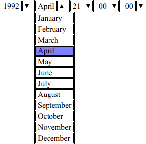

Option Picker
=============

Accessible custom `<select>` (and `<input list>`) element.

<picture>
  <source media="(prefers-color-scheme: dark)" srcset="2.png">
  <source media="(prefers-color-scheme: light)" srcset="1.png">
  
</picture>

Press <kbd>Enter</kbd> or <kbd>Space</kbd> key to open/close the options list. Use <kbd>ArrowDown</kbd> and
<kbd>ArrowUp</kbd> keys to open the options list and then focus on an option, then press <kbd>Enter</kbd>,
<kbd>Space</kbd>, or <kbd>Tab</kbd> to select it. On the “strict” option picker presentation, you should be able to type
away when you focus on it to select the first active option that contains text that matches the search query you are
currently typing. On the “loose” option picker presentation, when you start to input a value, the available options get
filtered instead of selected immediately.

Contribute
----------

 - **Please do not make pull requests by editing the files that are in the root of the project. They are generated
   automatically by the build tool.**
 - Install [Git](https://en.wikipedia.org/wiki/Git) and [Node.js](https://en.wikipedia.org/wiki/Node.js)
 - Run `git clone https://github.com/taufik-nurrohman/option-picker.git`
 - Run `cd option-picker && npm install --save-dev`
 - Edit the files in the `.factory` folder.
 - Run `npm run pack` to generate the production ready files.